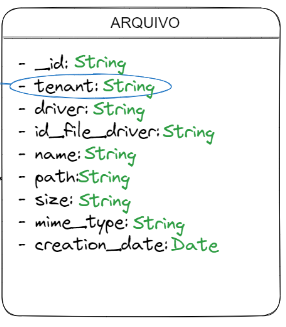
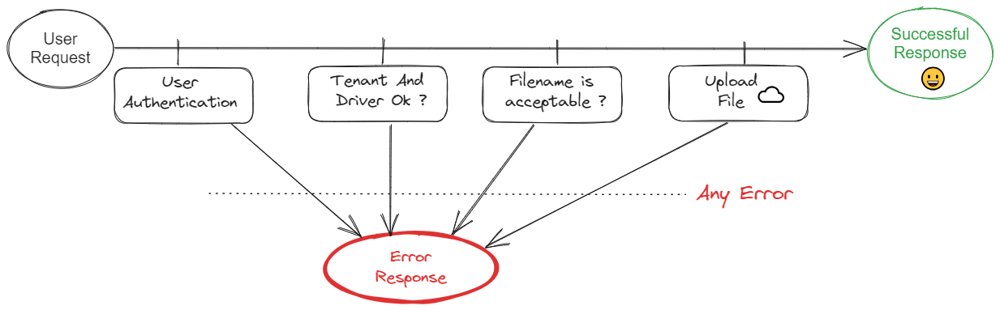
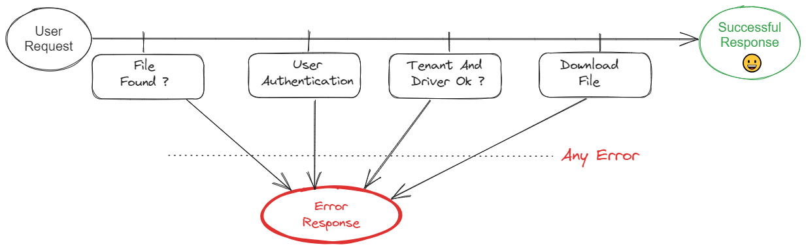

# Multi-tenant-uploader
OSS solution for uploading files to ☁️  in a multi-tenant context

## Executing project

To run the project, you will need the following:
  - `node 14.0.0`  or higher;
  - A package manager like `npm` or `yarn`;
  - A Mongo database.

Firstly, create a `.env` file in the root with the following variables.
```
URL_AUTH_SERVICE # URL of your service to authenticate user requests
DB_NAME # Name of your mongo database
MONGO_URL # URI connection string of your Mongo database
WHITELISTED_IP # List of ips already authenticated. Fill this way, `::ffff:***.**.*.*,::ffff:***.**.*.*`
```

With these vars filled properly, build the project with the following command:
```bash
yarn run build
```
After that, start the project:
```bash
yarn run start
```
The server will init in port `3003`.


## How does it work ?

Making a HTTP request passing file as a octect-stream, it will upload file using  tenant's driver. Later, you can retrieve this file using an automatically generated `id`.

### Tenant-driver Structure
Multi-tenant-uploader send files to cloud using drivers. A driver is a communication interface that we can use to access API of  some cloud storage service.

Each tenant has your own list of drivers and  each driver it's related to only a single cloud storage service.

To be able uploading files, you need to sign up your tenant in your mongo database as well as its driver's list. Each driver has its own properties containing all credentials data to access API of storage service.

Today, we have implemented drivers for the following services:

  - Micrososft OneDrive;
  - Amazon S3 - AWS.

Depending on which driver you will use for your tenant, you'll have to mount a document in a well-defined way inside a collection called `tenant-driver` in your mongo database. Below, it's the form for each tenant-driver, according to your cloud storage service.

#### Microsoft OneDrive
```json
  "tenant": "your_tenant_name",
  "drivers": [
    {
      "type": "one_drive",
      "properties": {
        "access_token": "your Microsoft access_token",
        "tenant_id": "<TENANT_ID>",
        "token_url": "https://login.microsoftonline.com/<TENANT_ID>/oauth2/v2.0/token",
        "upload_url": "https://graph.microsoft.com/v1.0/users/<USER_ID>/drive/root:",
        "client_id": "your_client_id",
        "client_secret": "your_client_secret",
        "grant_type": "client_credentials",
        "scope": "https://graph.microsoft.com/.default",
        "upload_folder": "folder to upload your files",
        "limit_file_size": "15mb",
        "download_url": "https://graph.microsoft.com/v1.0/users/<USER_ID>/drive/items",
        "token_creation_date": ""
      }
    }
  ]
},
```

#### Amazon S3 - AWS
```json
{
  "tenant": "your_tenant_name",
  "drivers": [
    {
      "type": "amazon_s3",
      "properties": {
        "access_key_id": "your_access_key_id",
        "secret_access_key": "your_secret_access_key",
        "region": "your_region",
        "bucket": "your_bucket",
        "upload_folder": "folder to upload your files"
      }
    }
  ]
}
```

After you upload a file, it will be created in your mongo database a document representing a file in a collection called `Arquivo` as showed in picture below:




### Available Endpoints

-  GET   `/about`  -> Just to check status of service.
-  POST `/upload/:tenant`  -> Upload file using the first driver of informed tenant
-  GET `/download/:tenant/:idFile` -> Download file of `idFile` id using first driver of informed tenant.

In folder `client_examples` there are many examples of upload/download requests that you can apply to your own files and make tests by yourself.

### Upload Flow




### Download Flow


